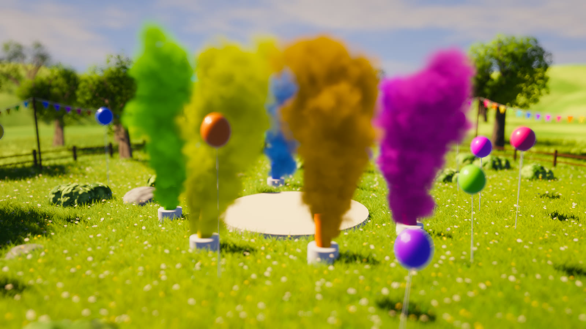

# HOLI

A colour-festival meadow built with [Bevy](https://bevyengine.org) 0.19: powder cannons
puff volumetric clouds of colour over a sunny, wind-swept field.



Everything is procedural, with no asset files besides the shaders:

- ~700k curved grass blades with daisies and buttercups, swayed by a wind vertex shader
- grown broadleaf trees (branching bark + alpha-masked leaf cards), rocks, bushes, hills
- raymarched powder volume with sun self-shadowing and animated detail noise
- fence, bunting, balloons, a painted sky
- HDR, ACES tonemapping, colour grading, bloom, vignette and bokeh depth of field

## Run

```sh
cargo run --release
```

## Controls

| Input | Action |
|---|---|
| Left drag | orbit |
| Shift + left drag | pan |
| Scroll | zoom |
| F1-F12, K (or click a panel row) | toggle grass, trees, powder, decor, rocks, stage, hills, sky, depth of field, bloom, grading, shadows, wind |
| F | toggle depth of field |
| Tab | hide the toggle panel |

## AI disclosure

Made with Claude Opus 5.5.

## License

Dual-licensed under either of [MIT](LICENSE-MIT) or [Apache-2.0](LICENSE-APACHE), at your option.

The shader hash functions are David Hoskins' "Hash without Sine" (MIT). Builds with Bevy's
default features embed the Fira Mono font (SIL Open Font License 1.1).
